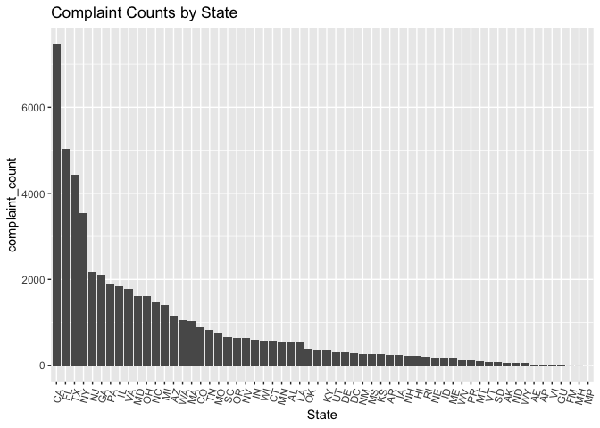
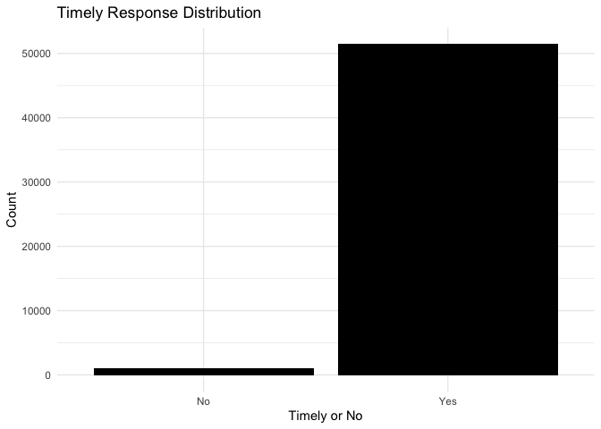
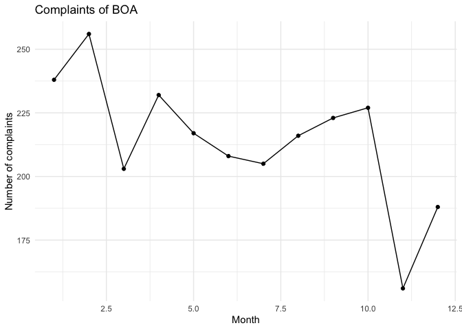

Class Project
================

## GitHub Documents

This is an R Markdown format used for publishing markdown documents to
GitHub. When you click the **Knit** button all R code chunks are run and
a markdown file (.md) suitable for publishing to GitHub is generated.

Note that the `echo = FALSE` parameter was added to the code chunk to
prevent printing of the R code that generated the plot.

``` r
library(ggplot2)
library(dplyr)
```

    ## 
    ## Attaching package: 'dplyr'

    ## The following objects are masked from 'package:stats':
    ## 
    ##     filter, lag

    ## The following objects are masked from 'package:base':
    ## 
    ##     intersect, setdiff, setequal, union

``` r
load("data/consumer_complaints_data.Rdata")
data <- select_res 
map_data <- data[, c("Complaint ID", "Company", "State")]

counts <- map_data %>%
  group_by(State) %>%
  summarise(complaint_count = n()) %>% 
  arrange(desc(complaint_count))

counts$State <- factor(counts$State, levels = counts$State)

ggplot(counts, aes(x = State, y = complaint_count)) +
  geom_bar(stat = "identity") +
  labs(title = "Complaint Counts by State", x = "State", y = "complaint_count") +
  theme(axis.text.x = element_text(angle = 75, hjust = 1))
```

<!-- -->

\#Time Response Distribution#

``` r
library(dplyr)
library(ggplot2)
product_distribution <- select_res %>%
  group_by(Product) %>%
  summarize(
    Count = n(),
    Percentage = Count / nrow(select_res) * 100
  ) %>%
  arrange(desc(Count))
product_distribution
```

    ## # A tibble: 11 × 3
    ##    Product                 Count Percentage
    ##    <chr>                   <int>      <dbl>
    ##  1 Mortgage                15508    29.5   
    ##  2 Debt collection         12794    24.3   
    ##  3 Credit reporting         9515    18.1   
    ##  4 Bank account or service  5348    10.2   
    ##  5 Credit card              5112     9.73  
    ##  6 Consumer Loan            1793     3.41  
    ##  7 Student loan             1444     2.75  
    ##  8 Payday loan               491     0.934 
    ##  9 Money transfers           400     0.761 
    ## 10 Prepaid card              114     0.217 
    ## 11 Other financial service    31     0.0590

``` r
timely_response <- (sum(select_res$`Timely response?` == "Yes"))/52550
print(timely_response)
```

    ## [1] 0.9788963

``` r
ggplot(select_res, aes(x = `Timely response?`)) +
  geom_bar(fill = "black") +
  labs(
    title = "Timely Response Distribution",
    x = "Timely or No",
    y = "Count"
  ) +
  theme_minimal()
```

<!-- -->

\#Complaints of BOA#

``` r
consumer_data <- select_res
library(tidyverse)
```

    ## ── Attaching core tidyverse packages ──────────────────────── tidyverse 2.0.0 ──
    ## ✔ forcats   1.0.0     ✔ stringr   1.5.0
    ## ✔ lubridate 1.9.2     ✔ tibble    3.2.1
    ## ✔ purrr     1.0.2     ✔ tidyr     1.3.0
    ## ✔ readr     2.1.4     
    ## ── Conflicts ────────────────────────────────────────── tidyverse_conflicts() ──
    ## ✖ dplyr::filter() masks stats::filter()
    ## ✖ dplyr::lag()    masks stats::lag()
    ## ℹ Use the conflicted package (<http://conflicted.r-lib.org/>) to force all conflicts to become errors

``` r
Fin_company <- c('Citybank', 'Bank of America', 'HSBC North America Holdings Inc.', 'Discover')
finance_data <- consumer_data %>% 
  filter(Company %in% Fin_company) %>% 
  group_by(State) %>% 
  summarise(count = n()) %>% 
  arrange(desc(count))

BOA <- consumer_data %>% 
  filter(Company == 'Bank of America',
         year(`Date received`) == 2014) %>% 
  mutate(Cmonth = month(`Date received`))

BOA <- BOA %>% 
  group_by(Cmonth) %>% 
  summarise(count = n())

library(ggplot2)

ggplot(BOA, aes(x = Cmonth, y = count))+
  geom_point()+
  geom_line()+
  theme_minimal()+
  labs(
    title = 'Complaints of BOA',
    x = 'Month',
    y = 'Number of complaints'
  )
```

<!-- -->
